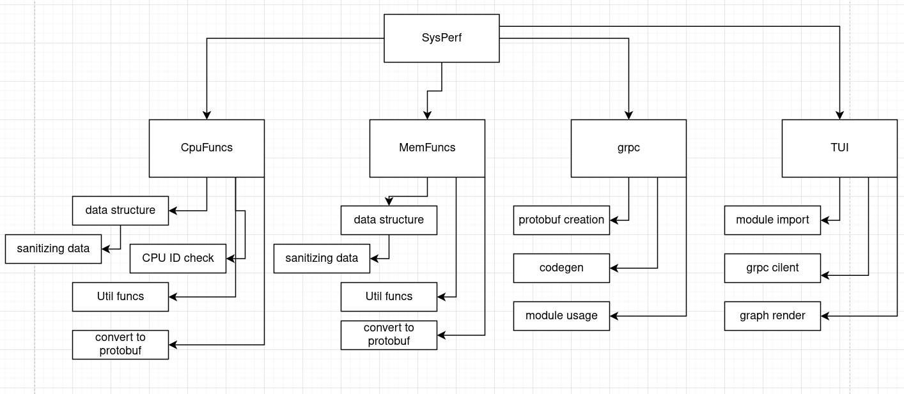

# Project Plan Document

## Teams Details

#### Member 1
- Name : P K Navin Shrinivas
- SRN : PES2UG20CS237
#### Member 2
- Name: Mukund Deepak
- SRN: PES2UG20CS206
#### Member 3
- Name : Mohamed Ayaan
- SRN : PES2UG20CS200
#### Member 4
- Name : Nandan H
- SRN : PES2UG20CS214

## Project Plan

### Identifying project plan 

As this is short timed project with a small team and changing requirements, We have opted for the agile/scrum methologies.

SCRUM allows our team to be as dynamic as possible! We are constantly adding features and issues alike. SCRUM helps us handles these easily.

### Tools and Libraries

We intend to use industry standard tools : 
- project management : JIRA, notion, discord.
- VCS : git and github.
- Rust tool chain : cargo, clippy, rustpls.
- GRPC : protoc, tonic, prost.
- Async runtime : tokio.
- Python toolchain : pyenv.
- Testing : postman, selenium (not decided yet).

### Deliverables 

As this is not a product facing porject and is instead a tool facing project, we have one major deliverable. That being the entire tool packaged in famous linux package managers.

But we also have a deliverable of backend and frontend themselves as we are loosely coupling them!

### Work Break Down[WBS] structure

A brief WBS amongst our team members : 
- Team member1 : Handles CPU and GRPC
- Team member2 : Handles Memory and Async cohenrence in backend
- Team member 3 : Handles Disk usage and GRPC client
- Team member 4 : Handles TUI

### Effort Estimates

> Note : The kloc estimates here are **extrememely** rough.

Considering our project type to be organic, and about 1.5 kloc. We get : 

Total Effort = 2.5*(1.5)^1.05 = 3.8 

Time = 2.5*(3.8)^0.38 = 4.1 months 

With a team of 4 people, we are looking at lesser than 4 weeks of completion time. This ties in exactly with our 1 sprint size of 4 weeks!

### Gnatt Chart 

We generated our gnatt chart using JIRA workspaces by atlassian.

The doc file [SysPerf.doc] for the same has been attached along with the same submission [As requested in the JIRA demo file] .

