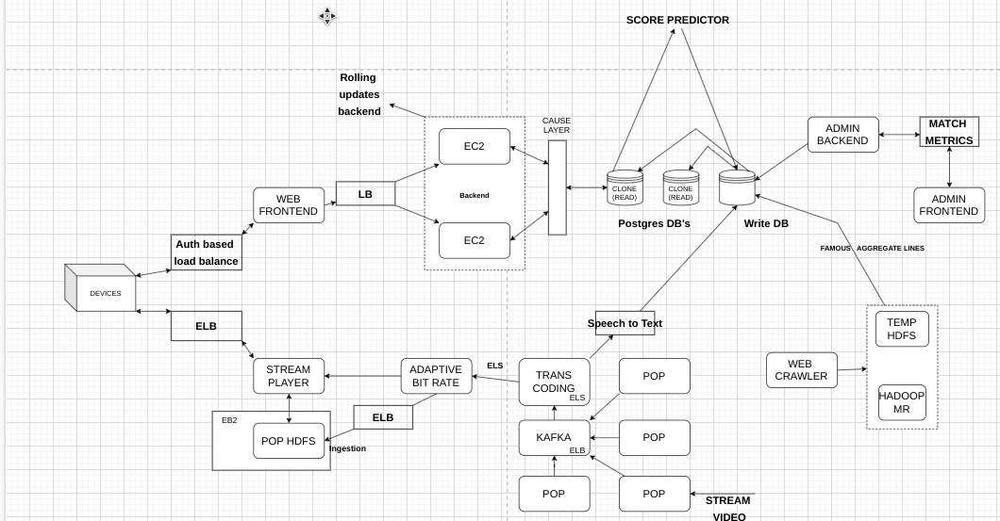

# U2 Lab  - Submission 

## Team Details : 
- Name : P K Navin Shrinivas [PES2UG20CS237]
- Name : Mohamed Ayaan [PES2UG20CS200]
- Name : Mukund Deepak [PES2UG20CS206]
- Name : Nandan H [PES2UG20CS214]

## Question 1 : Systems Design for IPL  : 

## Question 2 : MakeMyTrip DFD's :
### Top level DFD

### 2nd level DFD

### 3rd level DFD

