# U3 Software Engineering lab 

## Team Details : 
- Name : P K Navin Shrinivas [PES2UG20CS237]
- Name : Mohamed Ayaan [PES2UG20CS200]
- Name : Mukund Deepak [PES2UG20CS206]
- Name : Nandan H [PES2UG20CS214]

## Problem 1B : 

### Subquestion 1 : Print statements to see debugs in code : 
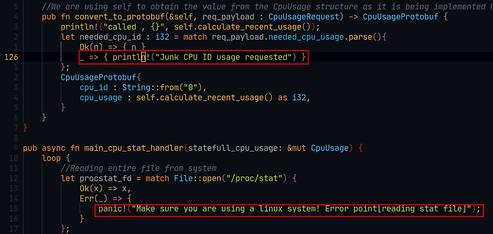

The above image shows two print statements accoring to the point in code the error occurs

### Subquestion 2 : Two test cases for valid and invalid cases :

**Valid case :**
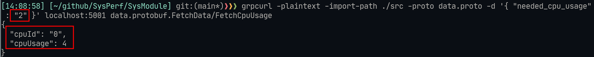
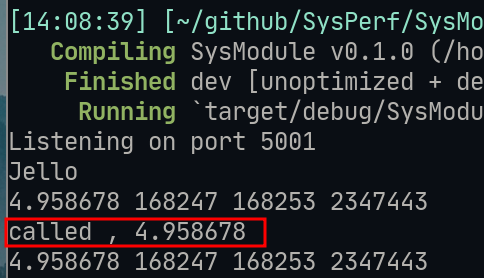

**Invalid case :**
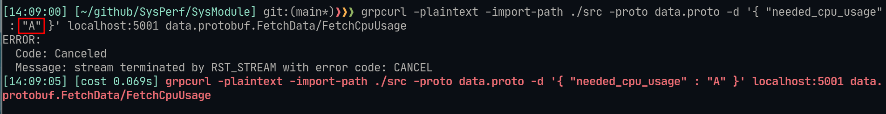
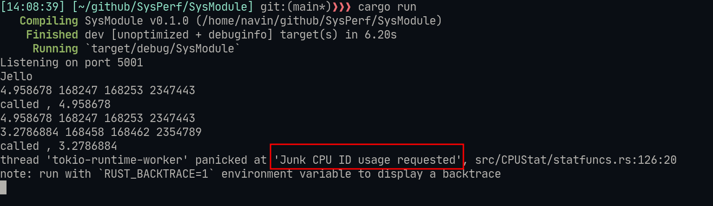

## Problem 3 : 

- We have 4 contributors to the project, implying we have 4 branches + 1 main branch
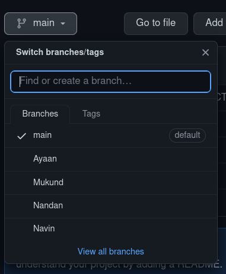

- Configuration Item table : 
<!---->
<!-- | Item Name            | tracked? | Maintainer | Category    | Relation                    | Description                                                   | -->
<!-- |----------------------|----------|------------|-------------|-----------------------------|---------------------------------------------------------------| -->
<!-- | build.rs             | yes      | common     | build       | depends on proto            | Works as build script for software                            | -->
<!-- | main.rs              | yes      | common     | code        | driver code for all modules | Brings together entire program                                | -->
<!-- | data.proto           | yes      | Navin      | coupling    | build.rs depends on this    | Defines protocols for communication                           | -->
<!-- | .env                 | no       | common     | environment | -                           | Holds various build env vars                                  | -->
<!-- | target/              | no       | common     | build       | -                           | All builds go here                                            | -->
<!-- | CPUStat/lib.rs       | yes      | Navin      | code        | main.rs depends on this     | defines interface and modules for CPU module                  | -->
<!-- | CPUStat/statfuncs.rs | yes      | Navin      | code        | main.rs depends on this     | defines functions for CPU module                              | -->
<!-- | MEMStat/lib.rs       | yes      | Ayaan      | code        | main.rs depends on this     | defines interface and modules for MEM module                  | -->
<!-- | MEMStat/memfuncs.rs  | yes      | Ayaan      | code        | main.rs depends on this     | defines functions for MEM module                              | -->
<!-- | Cargo.toml           | yes      | common     | build       | build.rs depends on this    | Defines all modules and crate used for building this software | -->
<!-- |                      |          |            |             |                             |                                                               | -->
<!---->

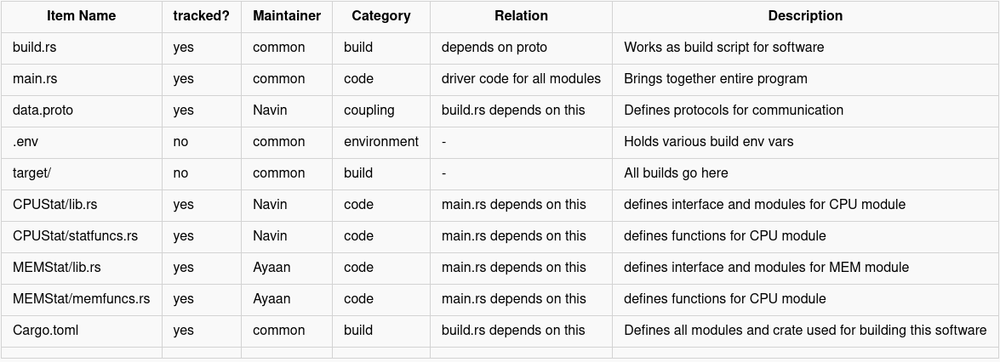

- Modifying Configuration Items | Ayaan : 
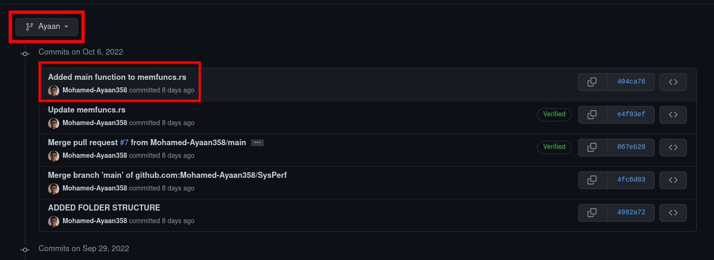
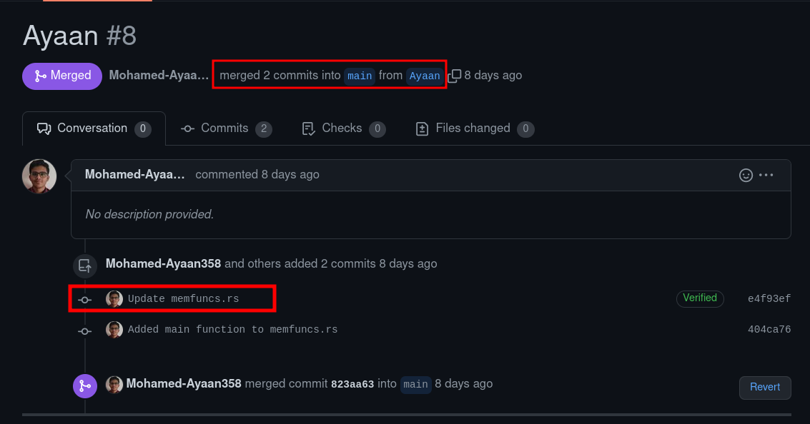
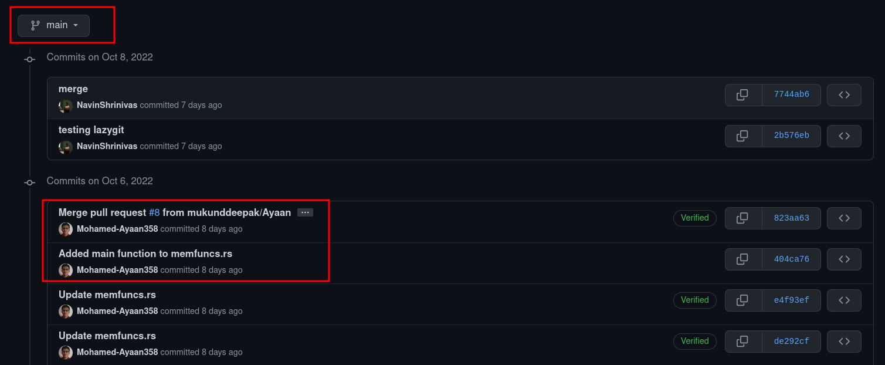

- Modifying Configuration Items | Navin : 
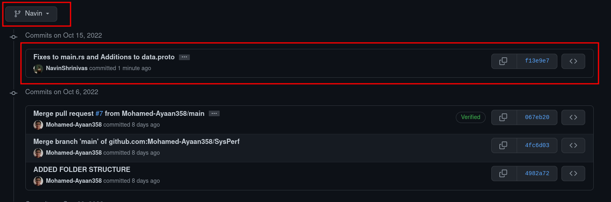
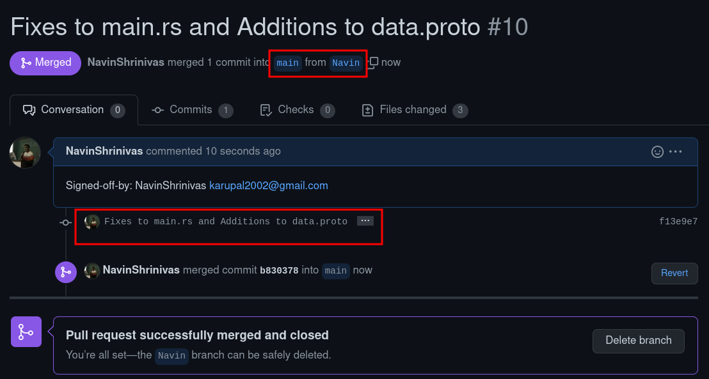
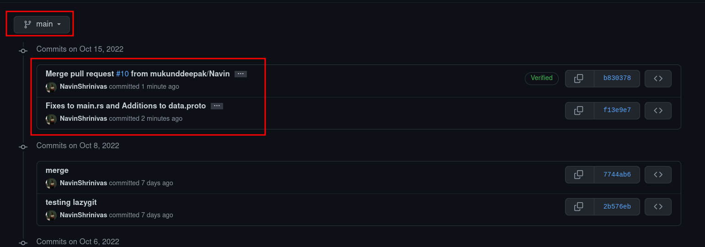

- Modifying Configuration Items | Mukund : 
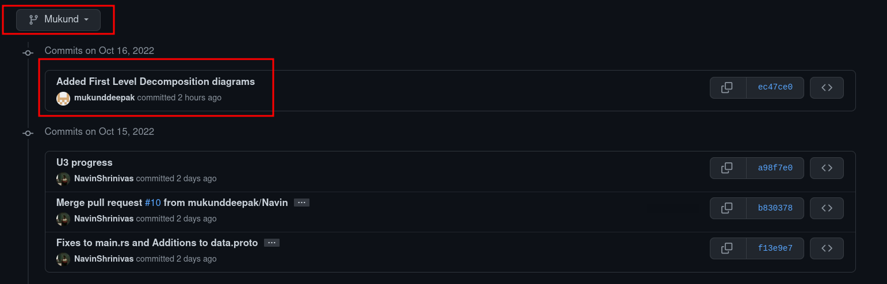
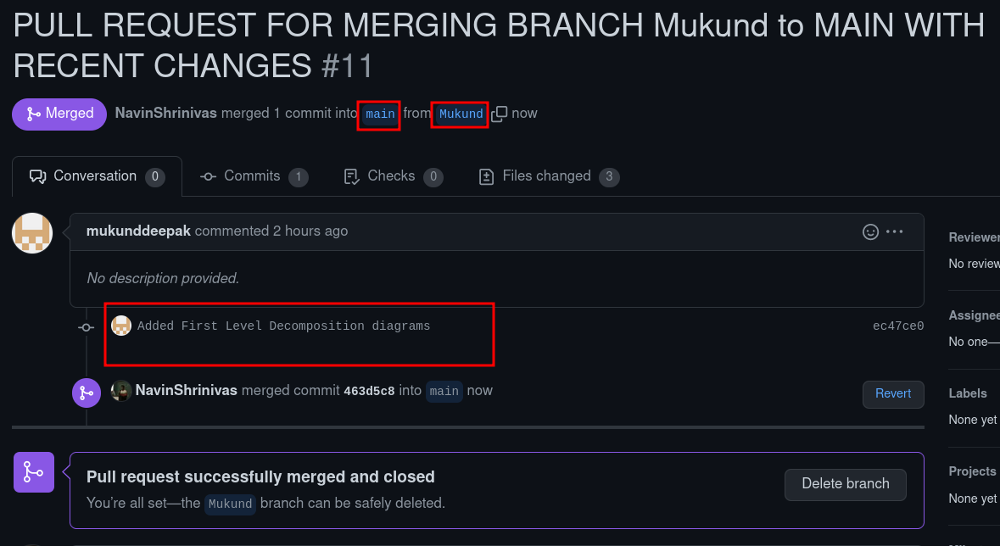

- Modifying Configuration Items | Nandan : 
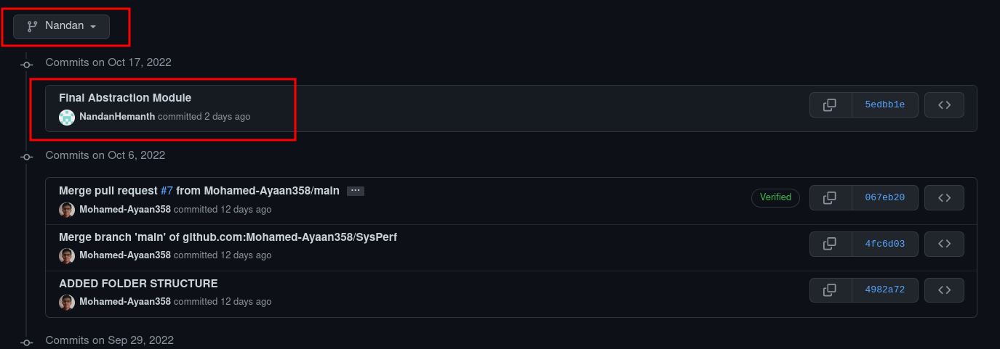
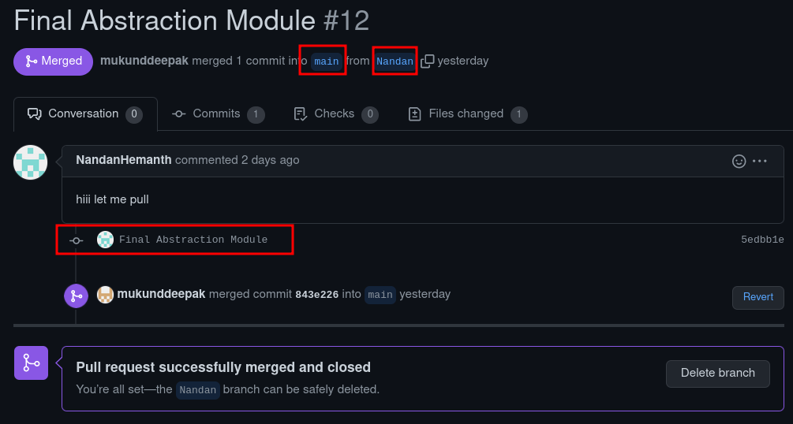
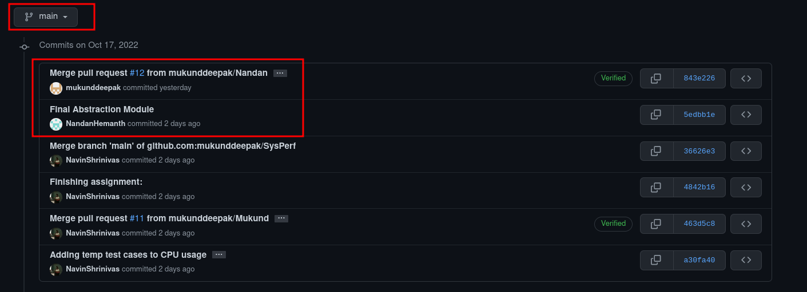

