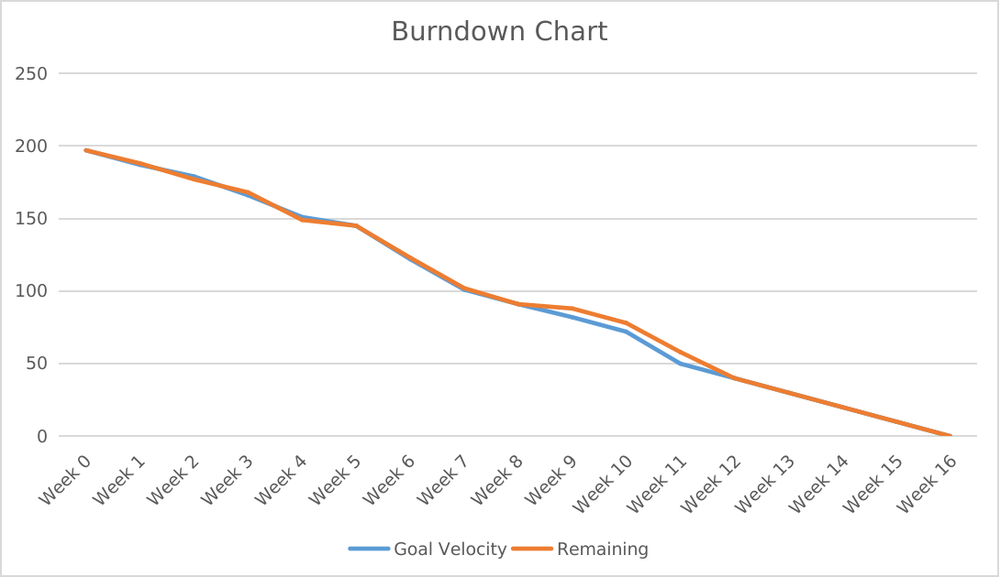

# Asginment | Task 2: Agile and Scrum

## Requirements 


### Functional Requirements
- Large selection of items 
- Intuitive UI for sellers, buyers and delivery personnel separately.
- Giving delivery personnel their dashboard
- Sort products based on originality 
- Having separate and modifiable pages for associated sellers.
- Ordering products based on location.
- User-Auth, also differentiate between sellers buyers and delivery personnel.
- Region-specific dialect.
- Cross-device Cart.
- Top-of-the-line CRM.

### Non Functional requirements 
- 90% of code testing coverage.
- ISO standards for all modules.
- Check if the seller is abiding by the laws of government and unions.
- Encrypted storage of user info.
- Low-cost maintenance website.
- Creating a highly available and reliable Big data store for the product.

## Timeline 

### Time info : 
- Start date: 1/1/22
- End date: 27/03/22
- Number of Sprints : 3 
- Duration of sprint: 4 weeks

## Modules/Components | Score: Product Backlog :
- Product listing module | Score: 15
    - Search bar | Score: 4
    - Put high-rated products first | Score: 3
    - Put original products first | Score: 2
    - Order products based on location and estimated delivery time | Score: 3
    - Filtering products | Score: 3
- Initial Landing page | Score: 5
    - Basic Page
    - Sponsored products
- Associated Company pages | Score: 10
    - Make the Associated company page show up in searches
    - Design team to help companies create their page
- Users Module | Score: 42
    - User Auth [diffrentiate between buyers, sellers and delivery personnel] | Score: 6
    - Languages | Score: 6
    - Buyers | Score: 10
        - Orders 
        - Cart [For Buyers] 
    - Seller | Score: 15
        - Listed/Listing products [ For sellers ]
        - Ratings of listed products
        - Buyer Feedback
        - Financial reports
        - Updates page (Acts as a line of comm between stakeholders and sellers)
        - Check if listed products are government compliant
    - Delivery personnel | Score: 10
        - Available deliveries 
        - Pending deliveries
        - Made deliveries
        - Updates page (Acts as a line of comm between stakeholder and delivery personnel)
- CRM module | Score: 12
    - CRM chat [Chat on both support side and buyer side]
    - CRM information

## Sprints

### Sprint 1 | Achieving story points : 46

 1. Split Up [Score: 5]
 ```
    - Assign team roles 
    - According to split research topics.
 ```
 2. Build Needs [Score: 5]
 ```
    - Setting up a Build server
    - Including CI/CD pipelines
    - Initiate some basic unit tests
 ```
 3. Communication and Collaboration needs [Score: 5]
 ```
    - Set up Version Control Systems
    - Setup up communication channels
    - Integrate comms and VCS
 ```
 4. Research Review [Score : 3]
 ```
    - Get clients developers and stakeholders together
    to make sure the research is in spec with requirements.
 ```
 5. Creating Prototype [Score: 10]
 6. Prototype Review [Score : 3]
 ```
    - Get clients developers and stakeholders 
    together to make sure the prototype is in 
    spec with requirements.
 ```
 7. Initial Landing page module [Score: 5]
 8. Users Module: Buyers [Score: 10]
 9. Beta release - 1


### Sprint 2 | Achieving Story points: 60

 1. User Auth [Score: 6]
 2. Product Listing module [Score: 15]
 3. Testing [Score: 8]
 ```
    - Setup Dummy data 
    - Write Unit tests
 ```
 4. User Modules: Languages [Score: 6]
 5. User Modules: Sellers [Score: 15]
 7. Merging Components [Score: 10]
 8. Beta release - 2


### Sprint 3 | Achieving story points : 51

 1. Payment Gateway [Score: 6]
 ```
    - Use existing payment gateway as per stakeholders' needs
 ```
 2. Review [Score : 3]
 ```
    - Make sure all modules and built products are on par
    with stakeholders needs
 ```
 3. Responsiveness Check [Score: 10]
 ```
    - Make sure the website pages and modules so far comply
    with devices of all sizes
 ```
 4. CRM Module [Score: 12]
 5. User Modules: Delivery personnel [Score: 10]
 6. Legal Acceptance page for all users [Score : 3]
 7. Merging Components [Score: 7]
 8. Alpha release - 1

### Sprint 4 | Achieving story points: 40

 1. Unit testing all previous modules [Score: 10]
 2. Associated company page [Score: 10]
 3. Final Review and changes [Score: 10]
 4. Production release [Score: 10]

## Burndown Chart

