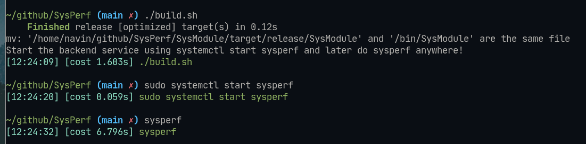

# SysPerf 

A modern-ish looking system monitor that uses what we would call the "next-gen" languages rust and go!

## Features 
- Uses a client server  model 
- Uses GRPC to connect the both

## Downsides : 
- Uses unsafe rust :( 
- Over complicated for a simple task, but tbf this project was done only to follow the guidelines of SE as part of the course in our Univerity!

## Where could it be used:
- Due to it being built on rust and go compilation and setting up the system is done very quickly.
- Due to its ightweight nature it will not take over too many computer resources to obtain the necessary information about the system.
## How to use : 

> Note : Needs Rust and go toochains installed before hand

