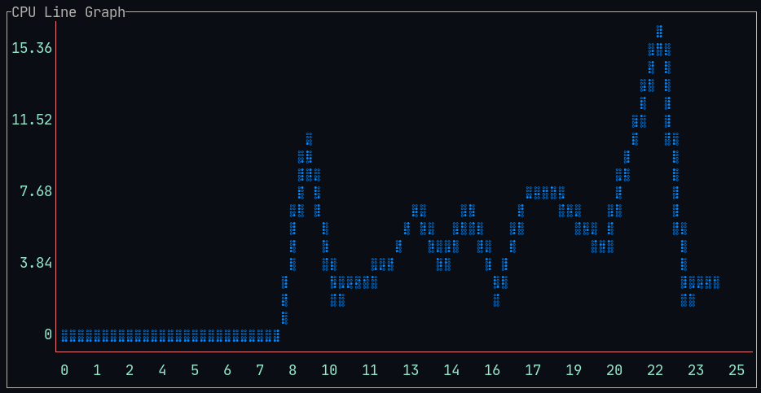
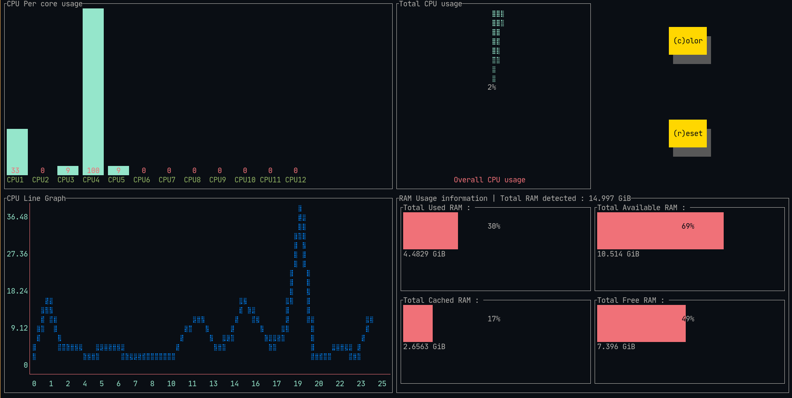

# SysPerf 

A modern-ish looking system monitor that uses what we would call the "next-gen" languages rust and go!

## Features 
- Uses a client server  model 
- Uses GRPC to connect the both

## Downsides : 
- Uses unsafe rust :( 
- Over complicated for a simple task, but tbf this project was done only to follow the guuidelines of SE as part of the course in our Univerity!

## Screenshots :

